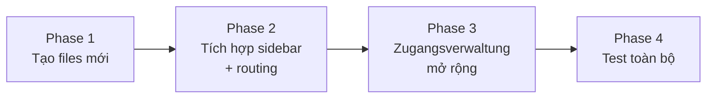

# Gộp GehaltsManager → OKYU HRM (Phương án B: Module Integration)

## Mục tiêu

Tích hợp **GehaltsManager** (quản lý lương) vào **OKYU HRM** (quản lý nhân sự) thành **1 super-app duy nhất**, với **1 hệ thống Rechte thống nhất** quản lý quyền truy cập cho tất cả modules.

---

## Các quyết định đã xác nhận ✅

| Quyết định | Kết luận |
|---|---|
| **Auth** | Hợp nhất — dùng Supabase Auth của OKYU HRM. Bỏ PIN-based. |
| **Supabase** | Giữ 2 client riêng (`sb` + `sbGehalt`), 2 database riêng |
| **Rechte** | Mở rộng `user_permissions` OKYU HRM → 58 keys tổng cộng |
| **Bảng `users` cũ** | Giữ nguyên trong DB GehaltsManager, không xóa, không dùng cho auth |
| **Sidebar** | **Option B** — Section đóng/mở `💰 Gehaltsmanager ▾` |
| **Einstellungen** | Gộp vào **Zugangsverwaltung** trong SYSTEM section |

---

## Sidebar sau khi gộp

```
┌──────────────────────────┐
│                          │
│  ALLGEMEIN               │
│  📊 Dashboard            │
│  👥 Mitarbeiter          │
│  🏢 Bereiche             │
│                          │
│  PLANUNG                 │
│  📅 Arbeitsplan          │ 
│  🏖️ Urlaubsplan          │
│  🤒 Krankmeldungen       │
│                          │
│  VERWALTUNG              │
│  📄 Unterlagen           │
│  📈 Berichte             │
│  ✅ Checklisten          │
│  🎓 Ausbildung           │
│                          │
│  💰 GEHALTSMANAGER    ▾  │  ← Collapsible section
│    📋 Abrechnung         │
│    🏦 Banken             │
│    📊 HRM Intern         │
│    💎 Smart Money        │
│                          │
│  SYSTEM                  │
│  🔐 Zugangsverwaltung    │  ← Rechte 58 keys + Gehalt Import/Sicherung
│  🏢 Standorte            │
│  📍 QR Check-in          │
│                          │
└──────────────────────────┘
```

---

## Zugangsverwaltung — nội dung mở rộng

Hiện tại Zugangsverwaltung quản lý users + permissions OKYU HRM. Sau khi gộp:

```
🔐 Zugangsverwaltung
├── Tab: Benutzer           ← Quản lý tài khoản (hiện có)
│   ├── Tên, Email, Rolle, Standort
│   └── + Neuer Benutzer
│
├── Tab: Berechtigungen     ← Rechte hợp nhất (MỚI, mở rộng)
│   ├── OKYU HRM (16 keys)
│   │   └── seeAllEmployees, editSchedules, approveVacations...
│   ├── GEHALTSMANAGER — SEITEN (5 keys)
│   │   └── seeGehaltAbr, seeGehaltBanken, seeGehaltHrm...
│   ├── GEHALTSMANAGER — SPALTEN (12 keys)
│   │   └── gm_see_gehalt, gm_see_brutto, gm_see_netto...
│   ├── GEHALTSMANAGER — BEARBEITEN (7 keys)
│   │   └── gm_edit_status, gm_edit_bar, gm_edit_stamm...
│   ├── GEHALTSMANAGER — FUNKTIONEN (8 keys)
│   │   └── gm_fn_import, gm_fn_export, gm_fn_abrechnung...
│   └── GEHALTSMANAGER — HRM/POPUP (10 keys)
│       └── gm_pop_kpi, gm_ansicht_hrm_intern...
│
├── Tab: Gehalt Import      ← Từ GehaltsManager Einstellungen (MỚI)
│   └── Upload CSV / JSON → sbGehalt database
│
└── Tab: Sicherung          ← Backup (MỚI)
    └── Export / Import full database snapshot
```

---

## Proposed Changes — Chi tiết file

### Phase 1: Chuẩn bị files mới (không ảnh hưởng app hiện tại)

---

#### [NEW] `js/supabase-gehalt.js` (~600 bytes)

Supabase client thứ 2 cho GehaltsManager database:
- URL: `emtvtmdequrnmhpdeqrv.supabase.co`
- Biến global: `sbGehalt` (tách biệt với `sb`)
- Chỉ dùng anon key, không auth

#### [NEW] `js/gehalt-module.js` (~120KB, lazy-loaded)

Refactor từ `app.js` GehaltsManager:
- **Bỏ**: Sidebar, header, auth, initApp (OKYU HRM đảm nhiệm)
- **Giữ**: renderAbrechnung, renderBanken, renderHRM, renderSmartMoney
- **Đổi**: `supabase` → `sbGehalt`
- **Đổi**: Internal `state.currentUser` → dùng `currentUser` global từ OKYU HRM
- **Đổi**: Permission check → dùng `can('gm_see_gehalt')` từ OKYU HRM
- **Export**: `initGehaltModule()`, `renderGehaltTab(tabId, container)`

#### [NEW] `js/gehalt-mappers.js` (~9KB)

Copy `mappers.js` từ GehaltsManager, giữ nguyên logic mapping DB ↔ App.

#### [NEW] `css/gehalt.css` (~17KB)

Copy `style.css` từ GehaltsManager. Classes đã có prefix `gm-*` → không conflict.

---

### Phase 2: Tích hợp vào OKYU HRM

---

#### [MODIFY] `index.html`

```diff
+ <link rel="stylesheet" href="css/gehalt.css">
+ <script src="js/supabase-gehalt.js"></script>
```

#### [MODIFY] `js/app-core.js`

1. **Sidebar**: Thêm section `💰 GEHALTSMANAGER` collapsible với 4 sub-items
2. **Routing**: Thêm `gehalt_abr`, `gehalt_banken`, `gehalt_hrm`, `gehalt_smart` cases
3. **Lazy-load**: Khi click lần đầu → `import('./gehalt-module.js')` → cache

```javascript
// Pseudo-code (KHÔNG phải code thật, chỉ minh họa)
if (tab.startsWith('gehalt_')) {
  if (!window._gehaltLoaded) {
    await loadScript('js/gehalt-mappers.js');
    await loadScript('js/gehalt-module.js');
    window._gehaltLoaded = true;
  }
  renderGehaltTab(tab, contentArea);
}
```

#### [MODIFY] `js/permissions.js`

Mở rộng `PERMS` object — thêm 42 keys prefix `gm_` cho mỗi role:

| Role | OKYU (16) | Gehalt (42) | Tổng |
|---|---|---|---|
| `inhaber` | ✅ tất cả | ✅ tất cả | 58/58 |
| `manager` | ✅ hầu hết | ✅ xem + edit status | ~40/58 |
| `mitarbeiter` | ⬜ hạn chế | ⬜ không truy cập | ~5/58 |
| `azubi` | ⬜ tối thiểu | ⬜ không truy cập | ~3/58 |

#### [MODIFY] `js/auth.js`

Thêm vào `loadUserPermissions()`: load thêm Gehalt permissions từ `user_permissions`.

---

### Phase 3: Zugangsverwaltung mở rộng

---

#### [MODIFY] `js/app-core.js` — section Zugangsverwaltung

Thêm 2 tabs mới trong Zugangsverwaltung:

1. **Tab "Gehalt Import"**: Upload CSV/JSON lương → insert vào `sbGehalt.from('gehaelter')`
2. **Tab "Sicherung"**: Export/import database snapshot

Mở rộng tab Berechtigungen hiện có:
- Thêm **6 nhóm** GehaltsManager permissions (giống modal Rechte đã làm)
- Presets: Inhaber / Buchhalter / Standortleiter / Mitarbeiter
- Checkbox grid 2 cột

---

## Thứ tự thực hiện



| Phase | Nội dung | Files | Thời gian |
|---|---|---|---|
| **1** | Copy CSS, tạo supabase-gehalt, refactor gehalt-module | 4 files mới | 3-4h |
| **2** | Sidebar collapsible + routing + lazy-load | app-core.js, index.html | 2h |
| **3** | Zugangsverwaltung: Rechte 58 keys, Import, Sicherung | permissions.js, app-core.js | 2h |
| **4** | Test end-to-end, fix bugs | — | 1-2h |
| | **Tổng** | | **~8-10h** |

---

## Rủi ro & Giải pháp

| Rủi ro | Mức độ | Giải pháp |
|---|---|---|
| File JS quá lớn (365KB tổng) | 🟡 Trung bình | Lazy-load: chỉ tải gehalt-module khi cần |
| CSS conflict | 🟢 Thấp | GehaltsManager dùng prefix `gm-*` → không đụng |
| 2 Supabase clients | 🟢 Thấp | Đã test — hoạt động song song tốt |
| Employee mapping giữa 2 DB | 🟡 Trung bình | Match bằng `name` + `location/betrieb` |
| Auth migration | 🟢 Thấp | Chỉ cần bỏ PIN-based, dùng OKYU auth |

---

## Kết quả cuối cùng

Sau khi gộp, user sẽ:
1. **Đăng nhập 1 lần** (OKYU HRM auth)
2. Thấy **sidebar đầy đủ** với section `💰 Gehaltsmanager` collapsible
3. **Rechte kiểm soát tất cả** — từ xem lương đến chấm công
4. **Zugangsverwaltung** quản lý 58 permissions + import + backup
5. **Performance tốt** — Gehalt chỉ load khi click (lazy-load)
